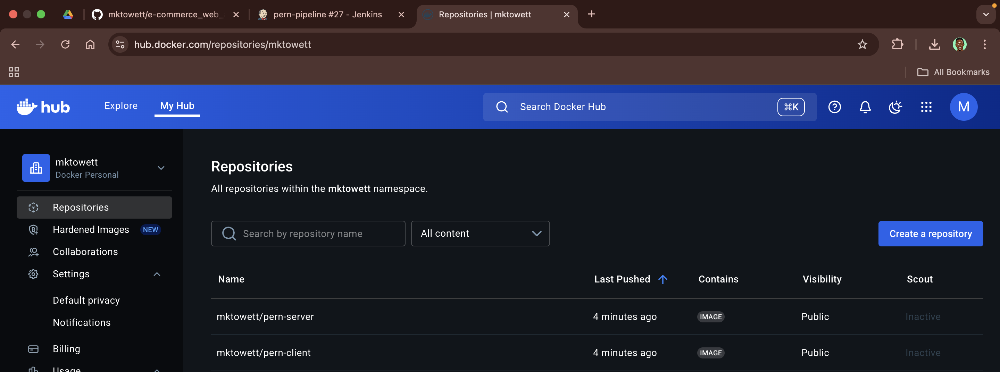

# E-Commerce DevOps: CI/CD to AWS EC2 with Docker, Nginx, Trivy, Prometheus & Grafana

[](https://github.com/mktowett/e-commerce_web_app_devOps)
[](https://hub.docker.com/u/mktowett)
[](https://opensource.org/licenses/MIT)

Full-stack e-commerce application (PERN stack) with production-grade DevOps pipeline: automated CI/CD via Jenkins, containerized deployment to AWS EC2, security scanning with Trivy, and real-time monitoring via Prometheus & Grafana.

---

## Table of Contents

- [Architecture](#architecture)
- [Tech Stack](#tech-stack)
- [Environments & Variables](#environments--variables)
- [CI/CD Pipeline](#cicd-pipeline)
- [Deployment (EC2)](#deployment-ec2)
- [Monitoring](#monitoring)
- [Security (DevSecOps)](#security-devsecops)
- [Local Development](#local-development)
- [Troubleshooting](#troubleshooting)
- [Screenshots](#screenshots)
- [Project Deliverables](#project-deliverables)
- [Roadmap](#roadmap)
- [License](#license)

---

## Architecture

The pipeline automates the journey from code commit to production deployment:

1. **Developer** pushes to `main` branch on GitHub
2. **Jenkins** detects the push (webhook or polling) and triggers the pipeline
3. **Build & Push**: Docker images are built and pushed to DockerHub with `latest` and `<SHORT_SHA>` tags
4. **Security Scan**: Trivy scans config files, filesystem, and images for vulnerabilities (HIGH/CRITICAL)
5. **Deploy**: Jenkins SSHs into EC2, pulls images from DockerHub, and restarts containers via `docker compose`
6. **Health Check**: Automated verification that `/api/health` returns 200
7. **Monitoring**: Prometheus scrapes metrics; Grafana visualizes system, container, and app metrics


### Routing Matrix

| Path       | Service         | Notes                           |
|------------|-----------------|---------------------------------|
| `/`        | React client    | Served via `serve` on port 3000 |
| `/api`     | Node server     | Health at `/api/health`         |
| `/metrics` | prom-client     | Prometheus metrics endpoint     |

> **Note**: Nginx reverse proxy is not currently configured; services are accessed directly via their ports. Future enhancement will add Nginx for unified routing and TLS termination.

---

## Tech Stack

- **Infrastructure**: Terraform (AWS EC2 t3.micro, Elastic IP, S3 for artifacts, IAM roles, Security Groups)
- **CI/CD**: Jenkins (Pipeline as Code via Jenkinsfile)
- **Containerization**: Docker, Docker Compose, Docker Buildx
- **Registry**: DockerHub (`mktowett/pern-client`, `mktowett/pern-server`)
- **Frontend**: React 18, Vite, TailwindCSS, Axios, React Router
- **Backend**: Node.js 18, Express, PostgreSQL 15, JWT, Stripe, prom-client
- **Monitoring**: Prometheus, Grafana, node-exporter, cAdvisor
- **Security**: Trivy (config, fs, image scans; SARIF & CycloneDX SBOM reports)

---

## Environments & Variables

### Server Environment Variables

| Variable            | Default/Example         | Description                                  |
|---------------------|-------------------------|----------------------------------------------|
| `NODE_ENV`          | `production`            | Runtime environment                          |
| `PORT`              | `9000`                  | Server listen port                           |
| `POSTGRES_HOST`     | `database`              | PostgreSQL hostname (Docker service name)    |
| `POSTGRES_DB`       | `ecommercestore`        | Database name                                |
| `POSTGRES_USER`     | `postgres`              | Database user                                |
| `POSTGRES_PASSWORD` | `<ADD_DB_PASSWORD>`     | Database password (keep secret)              |
| `POSTGRES_PORT`     | `5432`                  | Database port                                |
| `SECRET`            | `<ADD_JWT_SECRET>`      | JWT signing secret                           |
| `REFRESH_SECRET`    | `<ADD_REFRESH_SECRET>`  | JWT refresh token secret                     |
| `CORS_ORIGIN`       | `http://localhost:3000` | Allowed CORS origin (set to EC2 IP in prod)  |

### Client Environment Variables

| Variable            | Default/Example                | Description                          |
|---------------------|--------------------------------|--------------------------------------|
| `VITE_API_URL`      | `http://localhost:9000`        | Backend API base URL                 |

### Monitoring Environment Variables

| Variable                      | Default/Example | Description                      |
|-------------------------------|-----------------|----------------------------------|
| `GF_SECURITY_ADMIN_USER`      | `admin`         | Grafana admin username           |
| `GF_SECURITY_ADMIN_PASSWORD`  | `admin123`      | Grafana admin password           |
| `GF_SERVER_ROOT_URL`          | `http://localhost:3001` | Grafana public URL       |

### Secrets Management

- **DO NOT** commit `.env` files or secrets to Git
- Store production secrets in:
  - Jenkins credentials (for CI/CD)
  - EC2 instance `.env` files (for runtime)
  - AWS Secrets Manager (optional, for advanced setups)

---

## CI/CD Pipeline

The Jenkins pipeline is defined in [`Jenkinsfile`](Jenkinsfile) and executes the following stages:

### Pipeline Stages

1. **Checkout**
   - Clones the repository from GitHub

2. **Test (health check only)**
   - Runs `npm test` in a temporary Node container
   - No database required (simplified for CI stability)

3. **Docker Login**
   - Authenticates to DockerHub using Jenkins credentials (`dockerhub`)

4. **Build & Push Images**
   - Uses `docker buildx` for multi-platform builds (if needed)
   - Builds and pushes:
     - `mktowett/pern-client:latest`
     - `mktowett/pern-client:<SHORT_SHA>`
     - `mktowett/pern-server:latest`
     - `mktowett/pern-server:<SHORT_SHA>`
   - `<SHORT_SHA>` is the first 7 characters of the Git commit hash

5. **Security Scan (Trivy)**
   - **Config scan**: Scans Dockerfiles, docker-compose files for misconfigurations
   - **Filesystem scan**: Scans source code for vulnerabilities, secrets, and misconfigurations
   - **Image scan**: Scans Docker images for OS and application vulnerabilities
   - Severity filter: `HIGH,CRITICAL`
   - Exit code: `0` (non-blocking; deployment proceeds even if vulnerabilities are found)
   - Outputs:
     - `security/reports/trivy-config.txt`
     - `security/reports/trivy-fs.txt`
     - `security/reports/trivy-<image>.txt` (table format)
     - `security/reports/trivy-<image>.sarif` (SARIF for code quality tools)
     - `security/reports/sbom-<image>.cdx.json` (CycloneDX SBOM)
   - Reports are archived as Jenkins artifacts

6. **Deploy (main only)**
   - Triggered only when the branch is `main`
   - SSHs into EC2 instance
   - Executes:
     ```bash
     cd /opt/pern
     docker compose -f docker-compose.prod.yml pull
     docker compose -f docker-compose.prod.yml up -d
     ```
   - Waits up to 30 seconds for `/api/health` to return 200

### Triggering Builds

- **Automatic**: Configure a GitHub webhook to trigger builds on push to `main`
- **Manual**: Click "Build Now" in Jenkins UI

### Viewing Security Reports

- Navigate to the build in Jenkins
- Click "Build Artifacts"
- Download reports from `security/reports/`

---

## Deployment (EC2)

### Prerequisites

- EC2 instance provisioned via Terraform (see [terraform/README.md](terraform/README.md))
- Docker and Docker Compose installed on EC2 (handled by Terraform user-data script)
- Directory `/opt/pern` exists on EC2
- `docker-compose.prod.yml` copied to `/opt/pern` (or pulled from repo)

### Manual Deployment

If you need to deploy manually (outside Jenkins):

```bash
# SSH into EC2
ssh -i ~/.ssh/mklord ubuntu@<ADD_PUBLIC_IP_OR_DOMAIN>

# Navigate to deployment directory
cd /opt/pern

# Pull latest images from DockerHub
docker compose -f docker-compose.prod.yml pull

# Start/restart containers
docker compose -f docker-compose.prod.yml up -d

# Verify containers are running
docker ps
```

### Post-Deployment Health Checks

**On EC2:**

```bash
# Check API health
curl -sI http://127.0.0.1:9000/api/health | head -n1
# Expected: HTTP/1.1 200 OK

# Check container status
docker ps

# View logs
docker logs e-commerce-store-server -n 100
docker logs e-commerce-store-client -n 100
```

**From your local machine:**

```bash
# Check API health
curl -sI http://<ADD_PUBLIC_IP_OR_DOMAIN>:9000/api/health | head -n1

# Open frontend in browser
open http://<ADD_PUBLIC_IP_OR_DOMAIN>:3000

# Access Prometheus
open http://<ADD_PUBLIC_IP_OR_DOMAIN>:9090

# Access Grafana
open http://<ADD_PUBLIC_IP_OR_DOMAIN>:3001
```

---

## Monitoring

### Prometheus

- **URL**: `http://<ADD_PUBLIC_IP_OR_DOMAIN>:9090`
- **Config**: [`monitoring/prometheus/prometheus.yml`](monitoring/prometheus/prometheus.yml)
- **Scrape Targets**:
  - `prometheus:9090` (self-monitoring)
  - `node-exporter:9100` (system metrics: CPU, RAM, disk, network)
  - `cadvisor:8080` (Docker container metrics)
  - `pern-server:9000/metrics` (application metrics via prom-client)

### Grafana

- **URL**: `http://<ADD_PUBLIC_IP_OR_DOMAIN>:3001`
- **Default Credentials**: `admin` / `admin123` (change after first login)
- **Data Source**: Prometheus (pre-configured via provisioning)
- **Dashboards**: Place custom dashboard JSON files in `monitoring/grafana/dashboards/`

### Starting the Monitoring Stack

```bash
# On EC2 or locally
docker-compose -f docker-compose.monitoring.yml up -d

# Verify services
docker ps | grep -E 'prometheus|grafana|node-exporter|cadvisor'

# Check Prometheus targets
curl -s http://localhost:9090/api/v1/targets | jq '.data.activeTargets[] | {job, health}'
```

### Recommended Dashboards

Import these community dashboards in Grafana (Dashboard → Import):

- **Node Exporter Full**: ID `1860` (system metrics)
- **Docker Container & Host Metrics**: ID `179` (cAdvisor)
- **Custom App Dashboard**: Create panels for:
  - HTTP request rate (`rate(http_requests_total[5m])`)
  - Response time (`histogram_quantile(0.95, http_request_duration_seconds_bucket)`)
  - Error rate (`rate(http_errors_total[5m])`)

---

## Security (DevSecOps)

### Trivy Scanning

Trivy is integrated into the Jenkins pipeline to scan for vulnerabilities at multiple levels:

1. **Config Scan**: Detects misconfigurations in Dockerfiles, docker-compose files, and IaC
2. **Filesystem Scan**: Identifies vulnerabilities in dependencies, secrets in code, and misconfigurations
3. **Image Scan**: Scans Docker images for OS and application vulnerabilities

### Severity Gates

- **Current**: Scans report `HIGH` and `CRITICAL` vulnerabilities but do **not** block deployment (`--exit-code 0`)
- **To Enable Blocking**: Change `--exit-code 0` to `--exit-code 1` in the Trivy image scan commands in [`Jenkinsfile`](Jenkinsfile) (lines 122, 132)

### Viewing Reports

- **Jenkins**: Build Artifacts → `security/reports/`
- **Local**: After running Jenkins locally, check `security/reports/` in the workspace

### Report Formats

- **Table** (`.txt`): Human-readable summary
- **SARIF** (`.sarif`): For integration with code quality tools (e.g., GitHub Code Scanning)
- **CycloneDX** (`.cdx.json`): Software Bill of Materials (SBOM) for supply chain security

### Best Practices

- Review Trivy reports after each build
- Prioritize fixing `CRITICAL` vulnerabilities
- Use `.trivyignore` to suppress false positives (document reasons)
- Regularly update base images and dependencies

---

## Local Development

### Prerequisites

- Docker & Docker Compose
- Node.js 18+ (for local development without Docker)

### Run with Docker Compose

```bash
# Start all services (client, server, database)
docker-compose up --build

# Access:
# - Frontend: http://localhost:3000
# - Backend: http://localhost:9000
# - Database: localhost:5432
```

### Run Locally (without Docker)

**Backend:**

```bash
cd server
npm install
# Create .env file with database credentials
npm run dev
```

**Frontend:**

```bash
cd client
npm install
# Create .env file with VITE_API_URL
npm run start
```

**Database:**

```bash
# Start PostgreSQL via Docker
docker run -d \
  --name postgres-dev \
  -e POSTGRES_DB=ecommercestore \
  -e POSTGRES_USER=postgres \
  -e POSTGRES_PASSWORD=newpassword \
  -p 5432:5432 \
  postgres:15-alpine
```

---

## Troubleshooting

### Common Issues

#### 1. API Health Check Fails (502 Bad Gateway)

**Symptoms**: `curl http://<EC2_IP>:9000/api/health` returns 502 or times out

**Checks**:

```bash
# Verify server container is running
docker ps | grep server

# Check server logs
docker logs e-commerce-store-server -n 200

# Verify database connection
docker logs e-commerce-store-db -n 100

# Check port binding
docker port e-commerce-store-server
```

**Solutions**:
- Ensure `POSTGRES_HOST` matches the database service name in `docker-compose.yml`
- Verify database credentials in server environment variables
- Check if port 9000 is exposed and not blocked by firewall

#### 2. CORS Errors in Browser

**Symptoms**: Frontend can't reach backend; console shows CORS errors

**Checks**:

```bash
# Verify VITE_API_URL in client container
docker exec e-commerce-store-client env | grep VITE_API_URL

# Check server CORS configuration
docker logs e-commerce-store-server | grep -i cors
```

**Solutions**:
- Set `VITE_API_URL` to the correct backend URL (e.g., `http://<EC2_IP>:9000`)
- Update server `CORS_ORIGIN` to allow the frontend origin

#### 3. Jenkins Deploy Stage Fails

**Symptoms**: Deploy stage fails with SSH or Docker errors

**Checks**:

```bash
# On Jenkins server, test SSH connectivity
ssh -i /path/to/key ubuntu@<EC2_IP> "docker ps"

# Check Jenkins console output for error messages
```

**Solutions**:
- Verify SSH key is configured in Jenkins credentials
- Ensure Jenkins has network access to EC2 (security groups, VPN)
- Check that `/opt/pern` directory exists on EC2
- Verify `docker-compose.prod.yml` is present on EC2

#### 4. Trivy Scan Fails

**Symptoms**: Security Scan stage fails or hangs

**Checks**:

```bash
# Verify Trivy is installed on Jenkins server
trivy --version

# Check Trivy cache directory permissions
ls -ld /var/lib/trivy
```

**Solutions**:
- Install Trivy on Jenkins server (see [Trivy installation guide](https://aquasecurity.github.io/trivy/latest/getting-started/installation/))
- Ensure Jenkins user has write access to `TRIVY_CACHE_DIR`
- Increase timeout if scans are slow (large images)

#### 5. Docker Logs Commands

```bash
# View recent logs
docker logs <container_name> -n 200

# Follow logs in real-time
docker logs <container_name> -f

# View logs with timestamps
docker logs <container_name> -t

# Check all container statuses
docker compose -f docker-compose.yml ps
```

---

## Screenshots

Expected screenshots to be placed in `docs/screenshots/`:

- **jenkins_pipeline.png**: Jenkins pipeline showing all stages (Checkout, Test, Build & Push, Security Scan, Deploy) with green checkmarks
- **trivy_artifacts.png**: Jenkins build artifacts page showing Trivy reports in `security/reports/`
- **dockerhub_tags.png**: DockerHub repository page showing `latest` and `<SHORT_SHA>` tags for client and server images
- **ec2_docker_ps.png**: Terminal output of `docker ps` on EC2 showing running containers
- **app_home.png**: Screenshot of the e-commerce homepage
- **api_health_200.png**: Browser or curl output showing `/api/health` returning 200 OK
- **prometheus_targets.png**: Prometheus targets page showing all scrape targets UP
- **grafana_dashboards.png**: Grafana dashboard showing system, container, or app metrics

<!-- Uncomment when screenshots are added:
### Jenkins Pipeline


### DockerHub Tags


### Grafana Dashboards

-->

---

## Project Deliverables

This project fulfills all requirements for an end-to-end DevOps pipeline assignment:

### ✅ Completed Deliverables

| Requirement | Implementation | Location |
|-------------|----------------|----------|
| **Source Control** | GitHub repo with branching strategy (main branch) | [GitHub Repository](https://github.com/mktowett/e-commerce_web_app_devOps) |
| **CI/CD Pipeline** | Jenkins with automated testing, building, scanning, and deployment | [`Jenkinsfile`](Jenkinsfile) |
| **Infrastructure as Code** | Terraform provisions EC2, S3, Security Groups, IAM roles | [`terraform/`](terraform/) |
| **Containerization** | Docker images on DockerHub; Docker Compose for multi-service setup | [`docker-compose.yml`](docker-compose.yml), [`docker-compose.monitoring.yml`](docker-compose.monitoring.yml) |
| **Monitoring** | Prometheus + Grafana with 4 scrape targets (app, system, containers) | [`monitoring/`](monitoring/) |
| **DevSecOps** | Trivy scans (config, fs, image); reports archived in Jenkins | [CI/CD Pipeline](#cicd-pipeline), [Security](#security-devsecops) |
| **Code Repository** | Complete with comprehensive README | This document |
| **Architecture Diagram** | Pipeline flow and component interaction | `docs/architecture.png` (to be added) |
| **Live Demo** | Deployed on AWS EC2 | `http://<ADD_PUBLIC_IP_OR_DOMAIN>:3000` |
| **Monitoring Dashboards** | Prometheus & Grafana screenshots | [`docs/screenshots/`](#screenshots) |
| **CI/CD Config Files** | Jenkinsfile with 6 stages (Checkout, Test, Build, Scan, Deploy, Health Check) | [`Jenkinsfile`](Jenkinsfile) |

### 📊 Assignment Alignment

**Objective**: Build, containerize, and deploy a Node.js-based e-commerce app with full automation ✅

**Key Components Implemented**:
- ✅ **Source Control**: GitHub with main branch deployment strategy
- ✅ **CI/CD**: Jenkins pipeline that runs tests, builds Docker images, pushes to DockerHub, deploys to AWS EC2
- ✅ **IaC**: Terraform provisions complete AWS infrastructure (EC2 t3.micro, S3 artifacts bucket, Security Groups, Elastic IP)
- ✅ **Containerization**: Multi-service Docker Compose setup (client, server, database, monitoring stack)
- ✅ **Monitoring**: Prometheus scrapes 4 targets; Grafana visualizes metrics
- ✅ **DevSecOps**: Trivy scans all images for vulnerabilities; generates SARIF and SBOM reports

---

## Roadmap

Future enhancements:

- [ ] **Blocking Deployment on Critical Vulnerabilities**: Change Trivy `--exit-code 0` to `1` for image scans
- [ ] **Nginx Reverse Proxy**: Unified routing for all services (client, server, Jenkins) with TLS termination
- [ ] **Domain & TLS**: Configure custom domain with Let's Encrypt SSL certificates
- [ ] **Additional Exporters**: Add `nginx_exporter` and `postgres_exporter` for deeper monitoring
- [ ] **GitHub Release Automation**: Auto-create GitHub releases with changelog on version tags
- [ ] **Blue-Green Deployment**: Zero-downtime deployments with traffic switching
- [ ] **Automated Backups**: Scheduled PostgreSQL backups to S3

---

## License

This project is licensed under the MIT License. See [LICENSE](LICENSE) file for details.

---

## Author

**Marvin Towett**
- GitHub: [@mktowett](https://github.com/mktowett)
- DockerHub: [mktowett](https://hub.docker.com/u/mktowett)

---

<!-- PROVENANCE NOTES (for maintainer reference):
Data extracted from:
- Jenkinsfile: Pipeline stages, image names (mktowett/pern-client, mktowett/pern-server), Trivy scan config, deploy logic to /opt/pern
- docker-compose.yml: Service names (database, server, client), ports (5432, 9000, 3000), env vars, network (ecommercestore)
- docker-compose.monitoring.yml: Prometheus (9090), Grafana (3001, admin/admin123), node-exporter (9100), cAdvisor (8080)
- client/Dockerfile: Node 18-alpine, serve on port 3000, npm run build
- server/Dockerfile: Node 18-alpine, port 9000, npm start
- client/package.json: React 18, Vite, TailwindCSS, Axios
- server/package.json: Express, PostgreSQL (pg), prom-client, JWT, Stripe
- monitoring/prometheus/prometheus.yml: Scrape targets (prometheus, node-exporter, cadvisor, pern-server:9000/metrics)
- terraform/ec2.tf: t3.micro, Ubuntu 22.04, Docker preinstalled, /opt/pern directory, ports 22/80/443/3000/9000/5432/9090/3001
- terraform/s3.tf: Artifacts bucket with versioning
- terraform/outputs.tf: ec2_public_ip, elastic_ip, security_group
- PROJECT_GUIDE.md: Project overview, tech stack, phase completion status

Placeholders used:
- <ADD_PUBLIC_IP_OR_DOMAIN>: Replace with EC2 Elastic IP or custom domain
- <ADD_DB_PASSWORD>: Replace with actual PostgreSQL password
- <ADD_JWT_SECRET>: Replace with actual JWT signing secret
- <ADD_REFRESH_SECRET>: Replace with actual JWT refresh secret

Note: docker-compose.prod.yml not found in repo; assumed to be similar to docker-compose.yml but with production configs.
Note: Nginx config not found; routing is currently direct to service ports.
Note: Architecture diagram path set to docs/architecture.png (to be created).
-->
